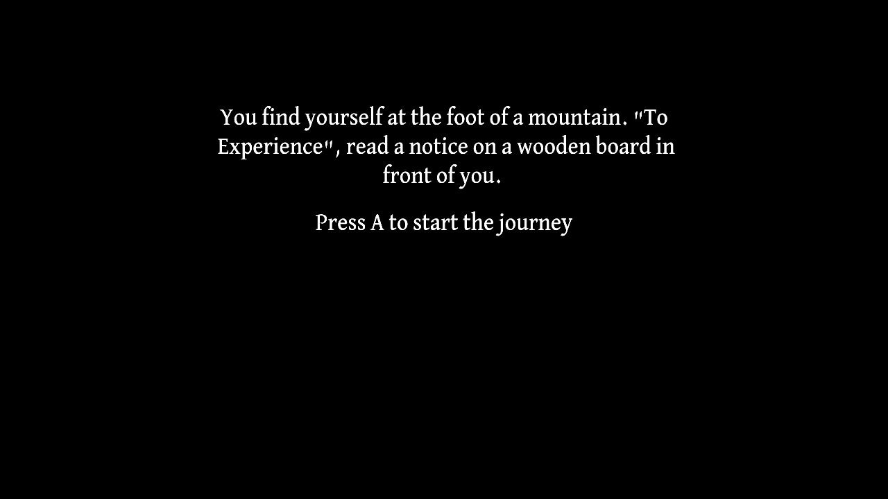

# To Experience

Author: YF

Design: A climbing story. You can make your choices according to the game instructions.

Text Drawing: It's included in the TextTexture and SceneScript files. SceneScript is to load the text assets at runtime. TextTexture is to compute the positions and the text at runtime.

Screen Shot:

How To Play:

Press A or D according to the instructions on the screen to change the scenes.

Sources: 

- Font: [DavidLibre-Medium](https://fonts.google.com/specimen/David+Libre). This Font Software is licensed under the SIL Open Font License, Version 1.1.

This game was built with [NEST](NEST.md).

